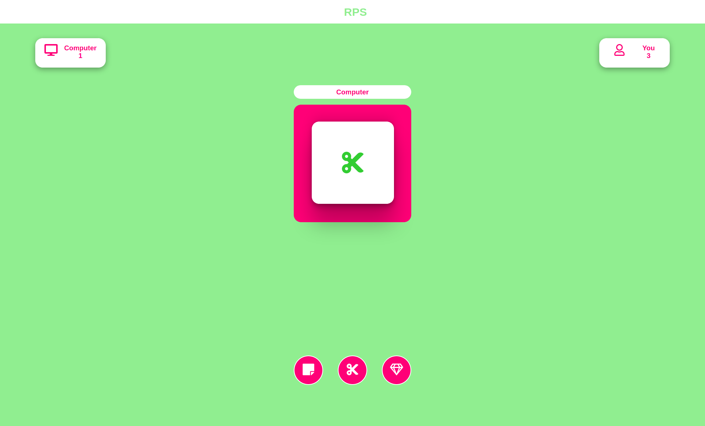

# Rock Paper Scissor JS

> ### What is this?
>
> 
>
> This is a game which is made using pure javascript css and html
>
> This is the digital version of the game rock paper scissor
> 
> ### How to use
> 
> To use this first clone the repository
> ```bash
> git clone https://github.com/AdithyanA2005/Rock_Paper_Scissors_JS.git
> ```
> 
> The go inside the folder and open the index.html file in a browser and start playing
>
>---
>